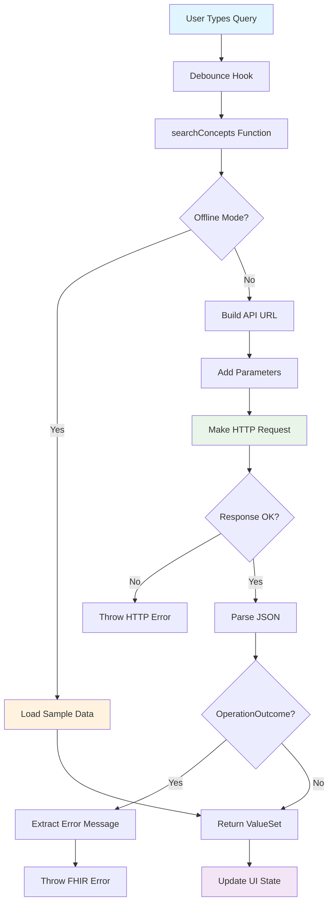
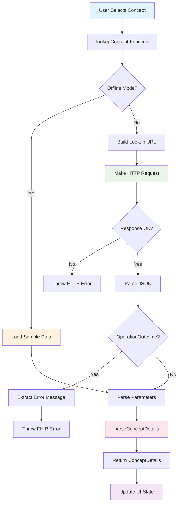

# 🔌 API Integration

**[← Components](Components.md)** | **[Next: Development →](Development.md)**

Comprehensive guide to FHIR API integration, data flow, and service layer architecture.

## 📋 Table of Contents

- [FHIR Integration Overview](#fhir-integration-overview)
- [Service Architecture](#service-architecture)
- [API Endpoints](#api-endpoints)
- [Data Flow](#data-flow)
- [Error Handling](#error-handling)
- [Offline Mode](#offline-mode)
- [Data Parsing](#data-parsing)
- [Configuration](#configuration)
- [Testing Strategy](#testing-strategy)

---

## FHIR Integration Overview

### 🏥 About FHIR

**Fast Healthcare Interoperability Resources (FHIR)** is a standard for healthcare data exchange. This application integrates with FHIR R4 endpoints to access SNOMED CT terminology services.

### 🎯 Integration Goals

1. **Search Phase**: Query SNOMED CT concepts using ValueSet `$expand`
2. **Detail Phase**: Retrieve comprehensive concept information via CodeSystem `$lookup`
3. **Offline Development**: Support local development with sample data
4. **Error Resilience**: Handle network failures and FHIR OperationOutcome responses

### 🌐 FHIR Server

**Default Endpoint**: [CSIRO OntoServer](https://r4.ontoserver.csiro.au/fhir)

- Production FHIR R4 terminology server
- SNOMED CT International Edition
- Australian Extension support
- Public sandbox environment

---

## Service Architecture

### 🏗️ Service Layer Structure

```
services/
└── fhirApi.ts                    # Main API service
    ├── searchConcepts()          # ValueSet $expand
    ├── lookupConcept()           # CodeSystem $lookup
    ├── parseConceptDetails()     # Response parsing
    ├── encodeSearchTerm()        # URL encoding
    └── CONFIG                    # Environment configuration
```

### 📦 Core Service Functions

```typescript
// src/services/fhirApi.ts

/**
 * Search SNOMED CT concepts using FHIR ValueSet $expand
 */
export async function searchConcepts(
  filter: string
): Promise<ValueSetExpansion>;

/**
 * Get detailed concept information using FHIR CodeSystem $lookup
 */
export async function lookupConcept(code: string): Promise<ConceptDetails>;

/**
 * Parse FHIR Parameters response into structured data
 */
export function parseConceptDetails(
  response: CodeSystemLookupResponse
): ConceptDetails;

/**
 * URL-encode search terms for API requests
 */
export function encodeSearchTerm(term: string): string;
```

### ⚙️ Configuration Management

```typescript
const CONFIG = {
  baseUrl:
    import.meta.env.VITE_FHIR_BASE_URL || "https://r4.ontoserver.csiro.au/fhir",
  offlineMode: import.meta.env.VITE_OFFLINE_MODE === "true",
  defaultCount: parseInt(import.meta.env.VITE_DEFAULT_COUNT || "100"),
  systemVersion:
    "http://snomed.info/sct|http://snomed.info/sct/32506021000036107/version/20250630",
  valueSetUrl: "http://snomed.info/sct/32506021000036107?fhir_vs",
  codeSystem: "http://snomed.info/sct",
};
```

---

## API Endpoints

### 🔍 ValueSet $expand (Search)

**Purpose**: Search for SNOMED CT concepts matching a filter term

#### **Endpoint**

```
GET {baseUrl}/ValueSet/$expand
```

#### **Parameters**

```typescript
interface ExpandParameters {
  _format: "json"; // Response format
  url: string; // ValueSet URL
  filter: string; // Search term
  "system-version": string; // SNOMED version
  includeDesignations: "true"; // Include designations
  count: string; // Max results
  elements: string; // Response elements
}
```

#### **Full Request Example**

```
GET https://r4.ontoserver.csiro.au/fhir/ValueSet/$expand?
  _format=json&
  url=http://snomed.info/sct/32506021000036107?fhir_vs&
  filter=total%20hip%20replacement&
  system-version=http://snomed.info/sct|http://snomed.info/sct/32506021000036107/version/20250630&
  includeDesignations=true&
  count=100&
  elements=expansion.contains.code,expansion.contains.display,expansion.contains.fullySpecifiedName,expansion.contains.active
```

#### **Response Structure**

```typescript
interface ValueSetExpansion {
  resourceType: "ValueSet";
  url: string;
  name: string;
  status: string;
  experimental: boolean;
  expansion: {
    identifier: string;
    timestamp: string;
    total: number;
    offset: number;
    parameter: Array<{
      name: string;
      valueString?: string;
      valueCode?: string;
      // ... other value types
    }>;
    contains: ConceptSuggestion[];
  };
}

interface ConceptSuggestion {
  system: string; // 'http://snomed.info/sct'
  code: string; // SNOMED CT code
  display: string; // Preferred term
  inactive?: boolean; // Concept status
  designation?: Designation[]; // Alternative terms
}
```

### 📊 CodeSystem $lookup (Details)

**Purpose**: Retrieve comprehensive information about a specific SNOMED CT concept

#### **Endpoint**

```
GET {baseUrl}/CodeSystem/$lookup
```

#### **Parameters**

```typescript
interface LookupParameters {
  code: string; // SNOMED CT code
  system: "http://snomed.info/sct"; // Code system
  property: "*"; // All properties
}
```

#### **Full Request Example**

```
GET https://r4.ontoserver.csiro.au/fhir/CodeSystem/$lookup?
  code=52734007&
  system=http://snomed.info/sct&
  property=*
```

#### **Response Structure**

```typescript
interface CodeSystemLookupResponse {
  resourceType: "Parameters";
  parameter: Parameter[];
}

interface Parameter {
  name: string; // Parameter name
  valueCode?: string; // Code value
  valueString?: string; // String value
  valueUri?: string; // URI value
  valueBoolean?: boolean; // Boolean value
  part?: ParameterPart[]; // Nested parameters
}

interface ParameterPart {
  name: string; // Part name
  valueCode?: string;
  valueString?: string;
  valueBoolean?: boolean;
  valueCoding?: {
    // Coded value
    system: string;
    code: string;
    display: string;
  };
}
```

---

## Data Flow

### 🌊 Search Flow



### 📋 Lookup Flow



### 🔄 Implementation Examples

#### **Search Implementation**

```typescript
export async function searchConcepts(
  filter: string
): Promise<ValueSetExpansion> {
  // Offline mode check
  if (CONFIG.offlineMode) {
    await new Promise((resolve) => setTimeout(resolve, 200)); // Simulate delay
    return expandSampleData as ValueSetExpansion;
  }

  // Build URL with parameters
  const url = new URL(`${CONFIG.baseUrl}/ValueSet/$expand`);
  const params = {
    _format: "json",
    url: CONFIG.valueSetUrl,
    filter: filter,
    "system-version": CONFIG.systemVersion,
    includeDesignations: "true",
    count: CONFIG.defaultCount.toString(),
    elements:
      "expansion.contains.code,expansion.contains.display,expansion.contains.fullySpecifiedName,expansion.contains.active",
  };

  Object.entries(params).forEach(([key, value]) => {
    url.searchParams.append(key, value);
  });

  // Make HTTP request
  try {
    const response = await fetch(url.toString(), {
      method: "GET",
      headers: {
        Accept: "application/fhir+json",
        "Content-Type": "application/fhir+json",
      },
    });

    if (!response.ok) {
      throw new Error(`HTTP ${response.status}: ${response.statusText}`);
    }

    const data = await response.json();

    // Check for FHIR OperationOutcome
    if (data.resourceType === "OperationOutcome") {
      const outcome = data as OperationOutcome;
      const errorMsg =
        outcome.issue[0]?.details?.text ||
        outcome.issue[0]?.diagnostics ||
        "FHIR operation failed";
      throw new Error(errorMsg);
    }

    return data as ValueSetExpansion;
  } catch (error) {
    console.error("Error searching concepts:", error);
    throw error;
  }
}
```

#### **Lookup Implementation**

```typescript
export async function lookupConcept(code: string): Promise<ConceptDetails> {
  // Offline mode check
  if (CONFIG.offlineMode) {
    await new Promise((resolve) => setTimeout(resolve, 150)); // Simulate delay
    return parseConceptDetails(lookupSampleData as CodeSystemLookupResponse);
  }

  // Build lookup URL
  const url = new URL(`${CONFIG.baseUrl}/CodeSystem/$lookup`);
  const params = {
    code: code,
    system: CONFIG.codeSystem,
    property: "*",
  };

  Object.entries(params).forEach(([key, value]) => {
    url.searchParams.append(key, value);
  });

  // Make HTTP request
  try {
    const response = await fetch(url.toString(), {
      method: "GET",
      headers: {
        Accept: "application/fhir+json",
        "Content-Type": "application/fhir+json",
      },
    });

    if (!response.ok) {
      throw new Error(`HTTP ${response.status}: ${response.statusText}`);
    }

    const data = await response.json();

    // Check for FHIR OperationOutcome
    if (data.resourceType === "OperationOutcome") {
      const outcome = data as OperationOutcome;
      const errorMsg =
        outcome.issue[0]?.details?.text ||
        outcome.issue[0]?.diagnostics ||
        "FHIR operation failed";
      throw new Error(errorMsg);
    }

    return parseConceptDetails(data as CodeSystemLookupResponse);
  } catch (error) {
    console.error("Error looking up concept:", error);
    throw error;
  }
}
```

---

## Error Handling

### 🚨 Error Types

#### **HTTP Errors**

```typescript
// Network and server errors
if (!response.ok) {
  throw new Error(`HTTP ${response.status}: ${response.statusText}`);
}

// Common HTTP status codes:
// 400 - Bad Request (invalid parameters)
// 404 - Not Found (concept not found)
// 500 - Internal Server Error
// 503 - Service Unavailable
```

#### **FHIR OperationOutcome Errors**

```typescript
interface OperationOutcome {
  resourceType: "OperationOutcome";
  issue: Array<{
    severity: "fatal" | "error" | "warning" | "information";
    code: string;
    details?: {
      text: string; // Human-readable error
    };
    diagnostics?: string; // Technical details
    location?: string[]; // Error location
  }>;
}

// Error extraction logic
const errorMsg =
  outcome.issue[0]?.details?.text ||
  outcome.issue[0]?.diagnostics ||
  "FHIR operation failed";
```

#### **Network Errors**

```typescript
// Fetch API network errors
try {
  const response = await fetch(url);
  // ... handle response
} catch (error) {
  if (error instanceof TypeError) {
    // Network error (offline, DNS failure, etc.)
    throw new Error("Network connection failed");
  }
  throw error;
}
```

### 🛡️ Error Recovery Strategies

#### **Retry Logic (Future Enhancement)**

```typescript
async function withRetry<T>(
  operation: () => Promise<T>,
  maxRetries: number = 3,
  baseDelay: number = 1000
): Promise<T> {
  for (let attempt = 1; attempt <= maxRetries; attempt++) {
    try {
      return await operation();
    } catch (error) {
      if (attempt === maxRetries) {
        throw error;
      }

      // Exponential backoff
      const delay = baseDelay * Math.pow(2, attempt - 1);
      await new Promise((resolve) => setTimeout(resolve, delay));
    }
  }
  throw new Error("All retry attempts failed");
}
```

#### **Graceful Degradation**

```typescript
// Fallback to cached data or offline mode
async function searchWithFallback(filter: string): Promise<ValueSetExpansion> {
  try {
    return await searchConcepts(filter);
  } catch (error) {
    console.warn("API call failed, falling back to cached data:", error);
    return getCachedSearchResults(filter);
  }
}
```

---

## Offline Mode

### 🔌 Offline Development Support

The application supports offline development using local sample data files, enabling consistent testing without network dependencies.

#### **Configuration**

```bash
# Enable offline mode
VITE_OFFLINE_MODE=true
```

#### **Sample Data Files**

**1st-expand-response.json** (5.6KB):

```json
{
  "resourceType": "ValueSet",
  "url": "http://snomed.info/sct/32506021000036107?fhir_vs",
  "expansion": {
    "identifier": "...",
    "timestamp": "2024-01-01T00:00:00Z",
    "total": 20,
    "contains": [
      {
        "system": "http://snomed.info/sct",
        "code": "52734007",
        "display": "Total hip replacement",
        "designation": [...]
      }
      // ... more concepts
    ]
  }
}
```

**2nd-lookup-response.json** (4.1KB):

```json
{
  "resourceType": "Parameters",
  "parameter": [
    { "name": "code", "valueCode": "52734007" },
    { "name": "display", "valueString": "Total hip replacement" },
    { "name": "system", "valueUri": "http://snomed.info/sct" },
    {
      "name": "property",
      "part": [
        { "name": "code", "valueCode": "definition" },
        {
          "name": "value",
          "valueString": "Total reconstruction of hip with prosthesis."
        }
      ]
    }
    // ... more parameters
  ]
}
```

#### **Offline Implementation**

```typescript
// Automatic delay simulation
if (CONFIG.offlineMode) {
  // Simulate network latency
  await new Promise((resolve) => setTimeout(resolve, 200));
  return expandSampleData as ValueSetExpansion;
}
```

### ✅ Benefits of Offline Mode

1. **Consistent Testing**: Predictable data for unit tests
2. **Development Speed**: No network dependencies
3. **Demo Capabilities**: Reliable demonstrations
4. **Error Testing**: Controlled error scenario testing

---

## Data Parsing

### 🔄 FHIR Parameters Parsing

The `parseConceptDetails` function transforms FHIR Parameters responses into structured TypeScript objects.

#### **Core Parsing Logic**

```typescript
export function parseConceptDetails(
  response: CodeSystemLookupResponse
): ConceptDetails {
  const params = response.parameter;

  const details: ConceptDetails = {
    code: "",
    display: "",
    system: "",
    inactive: false,
    parents: [],
    children: [],
    synonyms: [],
    properties: {},
    designations: [],
  };

  // Parse each parameter
  params.forEach((param) => {
    switch (param.name) {
      case "code":
        details.code = param.valueCode || "";
        break;
      case "display":
        details.display = param.valueString || "";
        break;
      case "system":
        details.system = param.valueUri || "";
        break;
      case "property":
        parsePropertyParameter(param, details);
        break;
      case "designation":
        parseDesignationParameter(param, details);
        break;
    }
  });

  return details;
}
```

#### **Property Parameter Parsing**

```typescript
function parsePropertyParameter(param: Parameter, details: ConceptDetails) {
  if (!param.part) return;

  const propertyCode = param.part.find((p) => p.name === "code")?.valueCode;
  const propertyValue = param.part.find((p) => p.name === "value");

  if (!propertyCode || !propertyValue) return;

  switch (propertyCode) {
    case "inactive":
      details.inactive = propertyValue.valueBoolean || false;
      break;
    case "definition":
      details.definition = propertyValue.valueString;
      break;
    case "parent":
      if (propertyValue.valueCode) {
        details.parents.push(propertyValue.valueCode);
      }
      break;
    case "child":
      if (propertyValue.valueCode) {
        details.children.push(propertyValue.valueCode);
      }
      break;
    default:
      // Store other properties
      details.properties[propertyCode] =
        propertyValue.valueString ||
        propertyValue.valueCode ||
        propertyValue.valueBoolean;
  }
}
```

#### **Designation Parameter Parsing**

```typescript
function parseDesignationParameter(param: Parameter, details: ConceptDetails) {
  if (!param.part) return;

  const language =
    param.part.find((p) => p.name === "language")?.valueCode || "en";
  const use = param.part.find((p) => p.name === "use")?.valueCoding;
  const value = param.part.find((p) => p.name === "value")?.valueString;

  if (!use || !value) return;

  const designation = {
    language,
    use: {
      system: use.system,
      code: use.code,
      display: use.display,
    },
    value,
  };

  details.designations.push(designation);

  // Extract specific designation types
  if (use.code === "900000000000013009") {
    // Synonym
    details.synonyms.push(value);
  } else if (use.code === "900000000000003001") {
    // Fully specified name
    details.fullySpecifiedName = value;
  }
}
```

### 📊 Parsed Data Structure

```typescript
interface ConceptDetails {
  code: string; // SNOMED CT code
  display: string; // Preferred term
  system: string; // Code system URL
  version?: string; // System version
  name?: string; // System name
  inactive: boolean; // Active status
  definition?: string; // Concept definition
  parents: string[]; // Parent concept codes
  children: string[]; // Child concept codes
  synonyms: string[]; // Alternative terms
  fullySpecifiedName?: string; // FSN
  properties: Record<string, any>; // Additional properties
  designations: Designation[]; // All designations
}
```

---

## Configuration

### ⚙️ Environment Variables

```typescript
// Configuration object with defaults
const CONFIG = {
  // FHIR Server
  baseUrl:
    import.meta.env.VITE_FHIR_BASE_URL || "https://r4.ontoserver.csiro.au/fhir",

  // Operation Mode
  offlineMode: import.meta.env.VITE_OFFLINE_MODE === "true",

  // Search Configuration
  defaultCount: parseInt(import.meta.env.VITE_DEFAULT_COUNT || "100"),

  // SNOMED CT Configuration
  systemVersion:
    "http://snomed.info/sct|http://snomed.info/sct/32506021000036107/version/20250630",
  valueSetUrl: "http://snomed.info/sct/32506021000036107?fhir_vs",
  codeSystem: "http://snomed.info/sct",
};
```

### 🔧 Configuration Options

| Variable             | Default          | Description                     |
| -------------------- | ---------------- | ------------------------------- |
| `VITE_FHIR_BASE_URL` | CSIRO OntoServer | FHIR R4 endpoint base URL       |
| `VITE_OFFLINE_MODE`  | `false`          | Enable offline sample data mode |
| `VITE_DEFAULT_COUNT` | `100`            | Maximum search results          |

### 🌐 FHIR Server Alternatives

```typescript
// Alternative FHIR servers (for reference)
const FHIR_SERVERS = {
  // CSIRO OntoServer (default)
  csiro: "https://r4.ontoserver.csiro.au/fhir",

  // NHS Digital FHIR Server
  nhs: "https://ontology.nhs.uk/authoring/fhir",

  // SNOWSTORM FHIR Server
  snowstorm: "https://snowstorm.your-domain.com/fhir",

  // Local development
  local: "http://localhost:8080/fhir",
};
```

---

## Testing Strategy

### 🧪 API Testing Coverage (35 Tests)

#### **Service Function Tests**

```typescript
describe("fhirApi Service", () => {
  describe("searchConcepts", () => {
    // ✅ API call structure and parameters
    // ✅ HTTP error handling (4xx, 5xx)
    // ✅ FHIR OperationOutcome parsing
    // ✅ Network error scenarios
    // ✅ Offline mode behavior
    // ✅ Response validation
  });

  describe("lookupConcept", () => {
    // ✅ API call structure and parameters
    // ✅ HTTP error handling
    // ✅ FHIR OperationOutcome parsing
    // ✅ Offline mode behavior
    // ✅ Response parsing integration
  });

  describe("parseConceptDetails", () => {
    // ✅ Complete parameter parsing
    // ✅ Property parameter handling
    // ✅ Designation parameter handling
    // ✅ Missing data graceful handling
    // ✅ Edge cases and malformed data
  });
});
```

#### **Mock Strategies**

```typescript
// HTTP fetch mocking
global.fetch = vi.fn();
const mockFetch = vi.mocked(fetch);

// Successful response
mockFetch.mockResolvedValueOnce({
  ok: true,
  json: async () => mockResponse,
} as Response);

// HTTP error
mockFetch.mockResolvedValueOnce({
  ok: false,
  status: 500,
  statusText: "Internal Server Error",
} as Response);

// Network error
mockFetch.mockRejectedValueOnce(new Error("Network unavailable"));
```

#### **Environment Testing**

```typescript
// Environment variable mocking
const mockEnv = {
  VITE_FHIR_BASE_URL: "https://test.fhir.server.com/fhir",
  VITE_OFFLINE_MODE: "false",
  VITE_DEFAULT_COUNT: "50",
};

Object.defineProperty(import.meta, "env", {
  value: mockEnv,
  writable: true,
});
```

---

## 🔗 Navigation

- **[⬅️ Components](Components.md)** - Detailed component documentation and usage
- **[➡️ Development Guide](Development.md)** - Development workflow and best practices
- **[🏗️ Architecture](Architecture.md)** - Code structure and design patterns
- **[🧪 Testing](Testing.md)** - Comprehensive testing strategy and coverage
- **[🏠 README](../README.md)** - Project overview and quick start

---

_This API documentation is part of the comprehensive Medical Data Search UI documentation suite._
