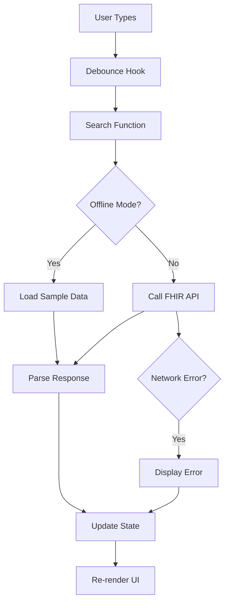

# 🏗️ Architecture Overview

**[← Back to README](../README.md)** | **[Next: Testing →](Testing.md)**

A comprehensive guide to the Medical Data Search UI architecture, design patterns, and code organization.

## 📋 Table of Contents

- [Architecture Principles](#architecture-principles)
- [Project Structure](#project-structure)
- [Design Patterns](#design-patterns)
- [Component Architecture](#component-architecture)
- [Data Flow](#data-flow)
- [State Management](#state-management)
- [Error Handling Strategy](#error-handling-strategy)
- [Type Safety](#type-safety)
- [Performance Optimizations](#performance-optimizations)

---

## Architecture Principles

### 🎯 Core Principles

The application follows key architectural principles:

1. **Single Responsibility Principle (SRP)**: Each component, hook, and service has one clear purpose
2. **DRY (Don't Repeat Yourself)**: Shared logic is abstracted into reusable utilities
3. **Separation of Concerns**: Clear boundaries between UI, business logic, and data access
4. **Testability**: Architecture designed for comprehensive unit testing
5. **Accessibility First**: WCAG 2.1 AA compliance built into the foundation

### 🔄 Architectural Patterns

- **Component-Based Architecture**: Modular React components with clear interfaces
- **Service Layer Pattern**: Abstracted API interactions with error handling
- **Custom Hooks Pattern**: Reusable stateful logic (debouncing, API calls)
- **Observer Pattern**: State changes propagate through React's unidirectional data flow
- **Repository Pattern**: Centralized data access through FHIR API service

---

## Project Structure

### 📁 High-Level Organization

```
src/
├── 📁 components/          # Presentation layer
│   ├── SearchInput.tsx     # Search interface component
│   ├── ConceptDetails.tsx  # Detail display component
│   └── *.css               # Component-specific styling
├── 📁 hooks/               # Custom React hooks
│   └── useDebounce.ts      # Debouncing logic
├── 📁 services/            # Business logic layer
│   └── fhirApi.ts          # FHIR API integration
├── 📁 types/               # Type definitions
│   └── fhir.ts             # FHIR data structures
├── 📁 utils/               # Utility functions
│   └── __tests__/          # Utility tests
├── 📁 test/                # Component tests
└── 📁 test-files/          # Sample data
```

### 🏛️ Layered Architecture

```
┌─────────────────────────────────────┐
│         Presentation Layer          │
│   (React Components + CSS)          │
├─────────────────────────────────────┤
│         Application Layer           │
│   (Custom Hooks + State Logic)      │
├─────────────────────────────────────┤
│         Service Layer               │
│   (API Calls + Data Processing)     │
├─────────────────────────────────────┤
│         Data Access Layer           │
│   (FHIR API + Sample Data)          │
└─────────────────────────────────────┘
```

---

## Design Patterns

### 🎭 Component Patterns

#### **Container/Presentational Pattern**

```typescript
// Container Component (App.tsx)
function App() {
  const [searchState, setSearchState] = useState<SearchState>({
    query: "",
    isLoading: false,
    suggestions: [],
    selectedConcept: null,
    error: null,
  });

  // Business logic and state management
  const handleSearch = useCallback(async (query: string) => {
    // Complex search logic
  }, []);

  return (
    <SearchInput
      onSearch={handleSearch}
      suggestions={searchState.suggestions}
      isLoading={searchState.isLoading}
    />
  );
}

// Presentational Component (SearchInput.tsx)
interface SearchInputProps {
  onSearch: (query: string) => void;
  suggestions: ConceptSuggestion[];
  isLoading: boolean;
  // ... other props
}

export function SearchInput({
  onSearch,
  suggestions,
  isLoading,
}: SearchInputProps) {
  // Only UI logic and user interactions
}
```

#### **Custom Hook Pattern**

```typescript
// useDebounce.ts - Reusable stateful logic
export function useDebounce<T>(value: T, delay: number): T {
  const [debouncedValue, setDebouncedValue] = useState<T>(value);

  useEffect(() => {
    const handler = setTimeout(() => {
      setDebouncedValue(value);
    }, delay);

    return () => clearTimeout(handler);
  }, [value, delay]);

  return debouncedValue;
}
```

### 🔧 Service Patterns

#### **Repository Pattern**

```typescript
// fhirApi.ts - Centralized data access
export class FHIRRepository {
  async searchConcepts(filter: string): Promise<ValueSetExpansion> {
    if (CONFIG.offlineMode) {
      return this.getOfflineData();
    }
    return this.makeAPICall(filter);
  }

  private async makeAPICall(filter: string): Promise<ValueSetExpansion> {
    // HTTP implementation
  }

  private async getOfflineData(): Promise<ValueSetExpansion> {
    // Sample data implementation
  }
}
```

#### **Strategy Pattern for Error Handling**

```typescript
interface ErrorHandler {
  handle(error: unknown): string;
}

class FHIRErrorHandler implements ErrorHandler {
  handle(error: unknown): string {
    if (error instanceof Error) {
      return error.message;
    }
    return "An unexpected error occurred";
  }
}

class OperationOutcomeHandler implements ErrorHandler {
  handle(outcome: OperationOutcome): string {
    return (
      outcome.issue[0]?.details?.text ||
      outcome.issue[0]?.diagnostics ||
      "FHIR operation failed"
    );
  }
}
```

---

## Component Architecture

### ⚛️ Component Hierarchy

```
App (Root Container)
├── SearchInput (Smart Component)
│   ├── Input Field
│   ├── Loading Indicator
│   ├── Error Display
│   └── Suggestions Dropdown
│       └── Suggestion Items
└── ConceptDetails (Smart Component)
    ├── Concept Header
    ├── Definition Section
    ├── Synonyms Section
    ├── Relationships Section
    └── Properties Section
```

### 🔗 Component Communication

```typescript
// Parent-Child Props Flow
App -> SearchInput: {
  onSearch: function,
  onSelect: function,
  suggestions: array,
  isLoading: boolean,
  error: string | null
}

App -> ConceptDetails: {
  concept: ConceptDetails | null,
  isLoading: boolean,
  error: string | null,
  onClose: function
}

// Event Flow (Child-Parent)
SearchInput -> App: onSearch(query)
SearchInput -> App: onSelect(concept)
ConceptDetails -> App: onClose()
```

### 🎨 Component Props Interface Design

```typescript
// Consistent prop interface patterns
interface ComponentProps {
  // Data props (what to display)
  data?: DataType;

  // State props (current state)
  isLoading?: boolean;
  error?: string | null;

  // Callback props (user interactions)
  onAction?: (param: Type) => void;

  // Configuration props (behavior)
  placeholder?: string;
  debounceDelay?: number;

  // Accessibility props
  "aria-label"?: string;
  id?: string;
}
```

---

## Data Flow

### 🌊 Unidirectional Data Flow

```
User Input → Component Event → State Update → Re-render → UI Update
     ↓              ↓              ↓           ↓          ↓
  [typing]    [onSearch]    [setSearchState] [render] [display]
```

### 📡 API Data Flow



### 🔄 State Transitions

```typescript
// Search State Machine
type SearchState = {
  query: string; // Current search term
  isLoading: boolean; // Loading indicator
  suggestions: Array; // Search results
  selectedConcept: null; // Selected concept details
  error: string | null; // Error message
};

// State transitions:
// IDLE → LOADING → SUCCESS → IDLE
// IDLE → LOADING → ERROR → IDLE
// SUCCESS → LOADING (new search) → SUCCESS/ERROR
```

---

## State Management

### 🎛️ State Architecture

The application uses React's built-in state management with clear patterns:

#### **Local Component State**

```typescript
// Simple UI state within components
const [isOpen, setIsOpen] = useState(false);
const [highlightedIndex, setHighlightedIndex] = useState(-1);
```

#### **Lifted State Pattern**

```typescript
// Shared state lifted to common ancestor (App.tsx)
const [searchState, setSearchState] = useState<SearchState>({
  query: "",
  isLoading: false,
  suggestions: [],
  selectedConcept: null,
  error: null,
});
```

#### **Derived State**

```typescript
// State computed from other state
const hasResults = suggestions.length > 0;
const showNoResults = !isLoading && !hasResults && query.trim();
```

### 🔄 State Update Patterns

```typescript
// Functional state updates for complex state
setSearchState((prev) => ({
  ...prev,
  isLoading: true,
  error: null,
}));

// Callback-based updates to prevent stale closures
const handleSearch = useCallback(async (query: string) => {
  setSearchState((prev) => ({ ...prev, isLoading: true }));
  // ... async logic
}, []);
```

---

## Error Handling Strategy

### 🛡️ Error Boundary Pattern

```typescript
// Hierarchical error handling
App Component
├── SearchInput Error Boundary
│   ├── Network Error Display
│   └── Validation Error Display
└── ConceptDetails Error Boundary
    ├── Loading Error Display
    └── Data Error Display
```

### 🚨 Error Types and Handling

```typescript
// Comprehensive error classification
interface ErrorHandler {
  // Network errors
  handleNetworkError(error: Error): string;

  // FHIR OperationOutcome errors
  handleFHIRError(outcome: OperationOutcome): string;

  // Validation errors
  handleValidationError(field: string, value: any): string;

  // Unexpected errors
  handleUnknownError(error: unknown): string;
}
```

### 🔧 Error Recovery Strategies

```typescript
// Retry mechanism for transient errors
async function withRetry<T>(
  operation: () => Promise<T>,
  maxRetries: number = 3
): Promise<T> {
  for (let attempt = 1; attempt <= maxRetries; attempt++) {
    try {
      return await operation();
    } catch (error) {
      if (attempt === maxRetries) throw error;
      await delay(attempt * 1000);
    }
  }
}

// Graceful degradation
function SearchWithFallback() {
  if (networkError) {
    return <OfflineSearchMessage />;
  }
  return <SearchInput />;
}
```

---

## Type Safety

### 📝 TypeScript Architecture

#### **Strict Type Configuration**

```json
// tsconfig.json
{
  "compilerOptions": {
    "strict": true,
    "noImplicitAny": true,
    "strictNullChecks": true,
    "noImplicitReturns": true
  }
}
```

#### **FHIR Type Definitions**

```typescript
// types/fhir.ts - Complete FHIR resource types
export interface ValueSetExpansion {
  resourceType: "ValueSet";
  url: string;
  expansion: {
    identifier: string;
    timestamp: string;
    total: number;
    contains: ConceptSuggestion[];
  };
}

// Discriminated unions for type safety
type APIResponse = ValueSetExpansion | OperationOutcome;

function isOperationOutcome(
  response: APIResponse
): response is OperationOutcome {
  return response.resourceType === "OperationOutcome";
}
```

#### **Generic Type Patterns**

```typescript
// Reusable generic interfaces
interface APIState<T> {
  data: T | null;
  isLoading: boolean;
  error: string | null;
}

// Usage
const [searchState, setSearchState] = useState<APIState<ConceptSuggestion[]>>({
  data: null,
  isLoading: false,
  error: null,
});
```

---

## Performance Optimizations

### ⚡ Optimization Strategies

#### **Debouncing**

```typescript
// Prevent excessive API calls
const debouncedQuery = useDebounce(query, 300);

useEffect(() => {
  if (debouncedQuery.trim()) {
    onSearch(debouncedQuery.trim());
  }
}, [debouncedQuery, onSearch]);
```

#### **Memoization**

```typescript
// Expensive computations
const processedSuggestions = useMemo(() => {
  return suggestions.map((concept) => ({
    ...concept,
    fullySpecifiedName: getFullySpecifiedName(concept),
  }));
}, [suggestions]);

// Callback stability
const handleSelect = useCallback((concept: ConceptSuggestion) => {
  // Stable callback reference
}, []);
```

#### **Lazy Loading**

```typescript
// Code splitting for large components
const ConceptDetails = lazy(() => import("./ConceptDetails"));

function App() {
  return (
    <Suspense fallback={<LoadingSpinner />}>
      <ConceptDetails />
    </Suspense>
  );
}
```

#### **Virtualization Strategy**

```typescript
// For large suggestion lists (if needed)
interface VirtualizedListProps {
  items: ConceptSuggestion[];
  itemHeight: number;
  visibleCount: number;
}

// Only render visible items for performance
```

---

## 🔗 Navigation

- **[⬅️ README](../README.md)** - Project overview and quick start
- **[➡️ Testing Strategy](Testing.md)** - Comprehensive testing approach
- **[⚛️ Component Guide](Components.md)** - Detailed component documentation
- **[🔌 API Integration](API.md)** - FHIR endpoints and data handling
- **[💻 Development Guide](Development.md)** - Development workflow and best practices

---

_This architecture documentation is part of the comprehensive Medical Data Search UI documentation suite._
