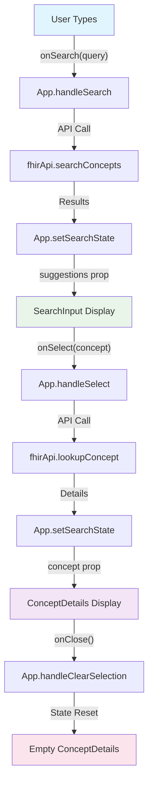

# ⚛️ Component Guide

**[← Testing](Testing.md)** | **[Next: API →](API.md)**

Detailed documentation for all React components in the Medical Data Search UI application.

## 📋 Table of Contents

- [Component Overview](#component-overview)
- [App Component](#app-component)
- [SearchInput Component](#searchinput-component)
- [ConceptDetails Component](#conceptdetails-component)
- [Component Interaction Flow](#component-interaction-flow)
- [Styling Architecture](#styling-architecture)
- [Accessibility Features](#accessibility-features)
- [Performance Considerations](#performance-considerations)

---

## Component Overview

### 🏗️ Component Hierarchy

```
App (Root Container)
├── SearchInput (Search Interface)
│   ├── Input Field
│   ├── Loading Indicator
│   ├── Error Display
│   └── Suggestions Dropdown
│       └── Suggestion Items
└── ConceptDetails (Detail Display)
    ├── Concept Header
    │   ├── Title & Fully Specified Name
    │   ├── Metadata (Code, System, Version)
    │   └── Close Button
    ├── Definition Section
    ├── Synonyms Section
    ├── Parent Concepts Section
    ├── Child Concepts Section
    ├── Designations Section
    └── Properties Section
```

### 📦 Component Types

| Component          | Type      | Responsibility                      | Tests    |
| ------------------ | --------- | ----------------------------------- | -------- |
| **App**            | Container | State management, API orchestration | 95 tests |
| **SearchInput**    | Smart     | User input, suggestions display     | 47 tests |
| **ConceptDetails** | Smart     | Concept data presentation           | 31 tests |

---

## App Component

### 📋 Overview

The root container component that manages application state, coordinates API calls, and orchestrates communication between child components.

### 🔧 Component Structure

```typescript
// src/App.tsx
function App() {
  // State Management
  const [searchState, setSearchState] = useState<SearchState>({
    query: "",
    isLoading: false,
    suggestions: [],
    selectedConcept: null,
    error: null,
  });

  const [conceptLoading, setConceptLoading] = useState(false);
  const [conceptError, setConceptError] = useState<string | null>(null);

  // Event Handlers
  const handleSearch = useCallback(async (query: string) => {
    /* ... */
  }, []);
  const handleSelect = useCallback(async (concept: ConceptSuggestion) => {
    /* ... */
  }, []);
  const handleClearSelection = useCallback(() => {
    /* ... */
  }, []);

  // Environment Configuration
  const isOfflineMode = import.meta.env.VITE_OFFLINE_MODE === "true";
  const debounceDelay = parseInt(import.meta.env.VITE_DEBOUNCE_DELAY || "300");

  return (
    <div className="app">
      {/* Header Section */}
      <div className="app-header">
        <h1>Medical Data Search UI</h1>
        {/* Offline Mode Badge */}
      </div>

      {/* Main Content */}
      <div className="app-content">
        <SearchInput
          onSearch={handleSearch}
          onSelect={handleSelect}
          suggestions={searchState.suggestions}
          isLoading={searchState.isLoading}
          error={searchState.error}
          debounceDelay={debounceDelay}
        />

        <ConceptDetailsComponent
          concept={searchState.selectedConcept}
          isLoading={conceptLoading}
          error={conceptError}
          onClose={handleClearSelection}
        />
      </div>

      {/* Footer Section */}
      <div className="app-footer">{/* FHIR Server Attribution */}</div>
    </div>
  );
}
```

### 📝 State Interface

```typescript
interface SearchState {
  query: string; // Current search term
  isLoading: boolean; // Search loading state
  suggestions: ConceptSuggestion[]; // Search results
  selectedConcept: ConceptDetails | null; // Selected concept
  error: string | null; // Search error message
}
```

### 🔄 State Management Patterns

#### **Search Flow State Transitions**

```typescript
// Search initiation
setSearchState((prev) => ({
  ...prev,
  query,
  isLoading: true,
  error: null,
}));

// Search success
setSearchState((prev) => ({
  ...prev,
  isLoading: false,
  suggestions: response.expansion.contains,
}));

// Search error
setSearchState((prev) => ({
  ...prev,
  isLoading: false,
  suggestions: [],
  error: errorMessage,
}));
```

#### **Concept Selection Flow**

```typescript
// Selection initiation
setConceptLoading(true);
setConceptError(null);
setSearchState((prev) => ({ ...prev, selectedConcept: null }));

// Selection success
setSearchState((prev) => ({ ...prev, selectedConcept: details }));
setConceptLoading(false);

// Selection error
setConceptError(errorMessage);
setConceptLoading(false);
```

### 🧪 Testing Coverage (95 Tests)

```typescript
// Key test categories
describe("App Component", () => {
  describe("Initial Render", () => {
    // UI elements, offline mode, environment config
  });

  describe("Search Functionality", () => {
    // Debounced search, loading states, error handling
  });

  describe("Concept Selection", () => {
    // Selection flow, detail loading, error scenarios
  });

  describe("State Management", () => {
    // Complex state transitions, multiple searches
  });

  describe("Error Boundaries", () => {
    // Error recovery, edge cases, accessibility
  });
});
```

---

## SearchInput Component

### 📋 Overview

A sophisticated search interface with type-ahead functionality, keyboard navigation, and accessibility features.

### 🔧 Component Interface

```typescript
interface SearchInputProps {
  onSearch: (query: string) => void; // Search callback
  onSelect: (concept: ConceptSuggestion) => void; // Selection callback
  suggestions: ConceptSuggestion[]; // Search results
  isLoading: boolean; // Loading state
  error: string | null; // Error message
  placeholder?: string; // Input placeholder
  debounceDelay?: number; // Debounce timing
}

export function SearchInput({
  onSearch,
  onSelect,
  suggestions,
  isLoading,
  error,
  placeholder = "Search for medical procedures or diagnoses...",
  debounceDelay = 300,
}: SearchInputProps) {
  // Component implementation
}
```

### 🎮 Internal State Management

```typescript
const [query, setQuery] = useState(""); // Input value
const [isOpen, setIsOpen] = useState(false); // Dropdown visibility
const [highlightedIndex, setHighlightedIndex] = useState(-1); // Keyboard navigation

const debouncedQuery = useDebounce(query, debounceDelay);
```

### ⌨️ Keyboard Navigation

```typescript
const handleKeyDown = (e: React.KeyboardEvent) => {
  if (!isOpen || suggestions.length === 0) return;

  switch (e.key) {
    case "ArrowDown":
      e.preventDefault();
      setHighlightedIndex((prev) =>
        prev < suggestions.length - 1 ? prev + 1 : 0
      );
      break;

    case "ArrowUp":
      e.preventDefault();
      setHighlightedIndex((prev) =>
        prev > 0 ? prev - 1 : suggestions.length - 1
      );
      break;

    case "Enter":
      e.preventDefault();
      if (highlightedIndex >= 0) {
        handleSelect(suggestions[highlightedIndex]);
      }
      break;

    case "Escape":
      setIsOpen(false);
      setHighlightedIndex(-1);
      break;
  }
};
```

### 🎨 Suggestion Rendering

```typescript
// Suggestion item structure
{
  suggestions.map((concept, index) => {
    const fullySpecifiedName = getFullySpecifiedName(concept);

    return (
      <li
        key={`${concept.system}-${concept.code}`}
        className={`suggestion-item ${
          index === highlightedIndex ? "highlighted" : ""
        } ${concept.inactive ? "inactive" : ""}`}
        role="option"
        aria-selected={index === highlightedIndex}
        onClick={() => handleSelect(concept)}
      >
        <div className="suggestion-content">
          <div className="display-name">{concept.display}</div>
          {fullySpecifiedName && fullySpecifiedName !== concept.display && (
            <div className="fully-specified-name">{fullySpecifiedName}</div>
          )}
          <div className="concept-code">
            Code: {concept.code}
            {concept.inactive && (
              <span className="inactive-badge">Inactive</span>
            )}
          </div>
        </div>
      </li>
    );
  });
}
```

### ♿ Accessibility Features

```typescript
// ARIA attributes for screen readers
<input
  type="text"
  value={query}
  onChange={handleInputChange}
  onKeyDown={handleKeyDown}
  aria-expanded={isOpen}
  aria-haspopup="listbox"
  aria-autocomplete="list"
  role="combobox"
/>

<ul
  className="suggestions-dropdown"
  role="listbox"
  aria-label="Search suggestions"
>
  {/* Suggestion items with proper ARIA */}
</ul>
```

### 🧪 Testing Coverage (47 Tests)

```typescript
describe("SearchInput Component", () => {
  describe("Input Handling", () => {
    // User typing, debouncing, validation
  });

  describe("Suggestions Display", () => {
    // Results rendering, no results, loading states
  });

  describe("Keyboard Navigation", () => {
    // Arrow keys, Enter, Escape, tab navigation
  });

  describe("Mouse Interaction", () => {
    // Click selection, hover highlighting
  });

  describe("Accessibility", () => {
    // ARIA attributes, screen reader support
  });

  describe("Edge Cases", () => {
    // Long text, empty data, rapid changes
  });
});
```

---

## ConceptDetails Component

### 📋 Overview

A comprehensive display component that presents detailed SNOMED CT concept information with hierarchical relationships and properties.

### 🔧 Component Interface

```typescript
interface ConceptDetailsProps {
  concept: ConceptDetails | null; // Concept data
  isLoading: boolean; // Loading state
  error: string | null; // Error message
  onClose?: () => void; // Close callback
}

export function ConceptDetailsComponent({
  concept,
  isLoading,
  error,
  onClose,
}: ConceptDetailsProps) {
  // Component implementation
}
```

### 🎭 Display States

#### **Loading State**

```typescript
if (isLoading) {
  return (
    <div className="concept-details loading">
      <div className="loading-indicator">
        <div className="spinner"></div>
        <span>Loading concept details...</span>
      </div>
    </div>
  );
}
```

#### **Error State**

```typescript
if (error) {
  return (
    <div className="concept-details error">
      <div className="error-message">
        <h3>Error Loading Concept Details</h3>
        <p>{error}</p>
      </div>
    </div>
  );
}
```

#### **Empty State**

```typescript
if (!concept) {
  return (
    <div className="concept-details placeholder">
      <div className="placeholder-content">
        <h3>Select a concept to view details</h3>
        <p>Use the search above to find medical procedures or diagnoses...</p>
      </div>
    </div>
  );
}
```

### 📊 Concept Data Display

#### **Header Section**

```typescript
<div className="concept-header">
  <div className="concept-title">
    <h2>{concept.display}</h2>
    {concept.fullySpecifiedName &&
      concept.fullySpecifiedName !== concept.display && (
        <div className="fully-specified-name">{concept.fullySpecifiedName}</div>
      )}
    <div className="concept-meta">
      <span className="code">Code: {concept.code}</span>
      <span className="system">System: {concept.system}</span>
      {concept.version && (
        <span className="version">Version: {concept.version}</span>
      )}
      {concept.inactive && <span className="status inactive">Inactive</span>}
    </div>
  </div>
  {onClose && (
    <button className="close-button" onClick={onClose}>
      ×
    </button>
  )}
</div>
```

#### **Conditional Sections**

```typescript
// Definition Section
{
  concept.definition && (
    <section className="definition-section">
      <h3>Definition</h3>
      <p className="definition">{concept.definition}</p>
    </section>
  );
}

// Synonyms Section
{
  concept.synonyms.length > 0 && (
    <section className="synonyms-section">
      <h3>Synonyms</h3>
      <ul className="synonyms-list">
        {concept.synonyms.map((synonym, index) => (
          <li key={index}>{synonym}</li>
        ))}
      </ul>
    </section>
  );
}

// Relationships Section
{
  concept.parents.length > 0 && (
    <section className="parents-section">
      <h3>Parent Concepts</h3>
      <div className="concept-codes">
        {concept.parents.map((parent, index) => (
          <span key={index} className="concept-code-link">
            {parent}
          </span>
        ))}
      </div>
    </section>
  );
}
```

### 🏷️ Designations Display

```typescript
{
  concept.designations.length > 0 && (
    <section className="designations-section">
      <h3>All Designations</h3>
      <div className="designations-table">
        {concept.designations.map((designation, index) => (
          <div key={index} className="designation-row">
            <div className="designation-type">{designation.use.display}</div>
            <div className="designation-value">{designation.value}</div>
            <div className="designation-language">{designation.language}</div>
          </div>
        ))}
      </div>
    </section>
  );
}
```

### 🔧 Properties Display

```typescript
{
  Object.keys(concept.properties).length > 0 && (
    <section className="properties-section">
      <h3>Additional Properties</h3>
      <div className="properties-table">
        {Object.entries(concept.properties).map(([key, value]) => (
          <div key={key} className="property-row">
            <div className="property-key">{key}</div>
            <div className="property-value">
              {typeof value === "boolean"
                ? value
                  ? "true"
                  : "false"
                : String(value)}
            </div>
          </div>
        ))}
      </div>
    </section>
  );
}
```

### 🧪 Testing Coverage (31 Tests)

```typescript
describe("ConceptDetailsComponent", () => {
  describe("Loading State", () => {
    // Loading indicator, spinner, accessibility
  });

  describe("Error State", () => {
    // Error display, error types, recovery
  });

  describe("Empty State", () => {
    // Placeholder content, user guidance
  });

  describe("Concept Display", () => {
    // Complete data display, metadata, sections
  });

  describe("Conditional Sections", () => {
    // Definition, synonyms, relationships, properties
  });

  describe("Edge Cases", () => {
    // Minimal data, long text, null values
  });
});
```

---

## Component Interaction Flow

### 🔄 Data Flow Diagram



### 📨 Event Communication

```typescript
// Parent → Child (Props)
App → SearchInput: {
  onSearch: (query: string) => void,
  onSelect: (concept: ConceptSuggestion) => void,
  suggestions: ConceptSuggestion[],
  isLoading: boolean,
  error: string | null
}

App → ConceptDetails: {
  concept: ConceptDetails | null,
  isLoading: boolean,
  error: string | null,
  onClose: () => void
}

// Child → Parent (Callbacks)
SearchInput → App: onSearch(query)
SearchInput → App: onSelect(concept)
ConceptDetails → App: onClose()
```

---

## Styling Architecture

### 🎨 CSS Organization

```
src/
├── App.css                    # Global app styles
├── index.css                  # Base styles, CSS reset
├── components/
│   ├── SearchInput.css        # Search component styles
│   └── ConceptDetails.css     # Details component styles
```

### 🌈 Design System

#### **Color Palette**

```css
:root {
  /* Primary Colors */
  --primary-blue: #1976d2;
  --primary-light: #42a5f5;
  --primary-dark: #1565c0;

  /* Status Colors */
  --success-green: #4caf50;
  --warning-orange: #ff9800;
  --error-red: #f44336;

  /* Neutral Colors */
  --text-primary: #212121;
  --text-secondary: #757575;
  --background: #fafafa;
  --surface: #ffffff;
}
```

#### **Typography Scale**

```css
/* Heading Hierarchy */
.app h1 {
  font-size: 2rem;
  font-weight: 600;
}
.concept-details h2 {
  font-size: 1.5rem;
  font-weight: 500;
}
.concept-details h3 {
  font-size: 1.25rem;
  font-weight: 500;
}

/* Body Text */
.body-text {
  font-size: 1rem;
  line-height: 1.5;
}
.caption {
  font-size: 0.875rem;
  color: var(--text-secondary);
}
```

#### **Component-Specific Styles**

**SearchInput Styling:**

```css
.search-input {
  width: 100%;
  padding: 12px 16px;
  border: 2px solid #e0e0e0;
  border-radius: 8px;
  font-size: 16px;
  transition: border-color 0.2s ease;
}

.search-input:focus {
  outline: none;
  border-color: var(--primary-blue);
  box-shadow: 0 0 0 3px rgba(25, 118, 210, 0.1);
}

.suggestions-dropdown {
  max-height: 400px;
  overflow-y: auto;
  border: 1px solid #e0e0e0;
  border-radius: 8px;
  background: white;
  box-shadow: 0 4px 12px rgba(0, 0, 0, 0.1);
}

.suggestion-item {
  padding: 12px 16px;
  cursor: pointer;
  border-bottom: 1px solid #f0f0f0;
}

.suggestion-item.highlighted {
  background-color: #f5f5f5;
}
```

**ConceptDetails Styling:**

```css
.concept-details {
  background: white;
  border-radius: 12px;
  padding: 24px;
  box-shadow: 0 2px 8px rgba(0, 0, 0, 0.1);
}

.concept-header {
  display: flex;
  justify-content: space-between;
  align-items: flex-start;
  margin-bottom: 24px;
  padding-bottom: 16px;
  border-bottom: 1px solid #e0e0e0;
}

.concept-meta {
  display: flex;
  gap: 16px;
  margin-top: 8px;
  font-size: 0.875rem;
  color: var(--text-secondary);
}
```

---

## Accessibility Features

### ♿ WCAG 2.1 AA Compliance

#### **Keyboard Navigation**

- **Tab Order**: Logical tab sequence through interactive elements
- **Arrow Keys**: Navigation within suggestion lists
- **Enter/Space**: Activation of buttons and selections
- **Escape**: Close dropdowns and modals

#### **Screen Reader Support**

```typescript
// ARIA Labels and Descriptions
<input
  aria-label="Search for medical procedures and diagnoses"
  aria-describedby="search-instructions"
  aria-expanded={isOpen}
  aria-haspopup="listbox"
/>

<div id="search-instructions" className="sr-only">
  Type to search for SNOMED CT concepts. Use arrow keys to navigate suggestions.
</div>

// Live Regions for Dynamic Content
<div aria-live="polite" aria-atomic="true">
  {isLoading && "Loading search results..."}
  {error && `Error: ${error}`}
  {suggestions.length > 0 && `${suggestions.length} suggestions available`}
</div>
```

#### **Color and Contrast**

- **Contrast Ratio**: Minimum 4.5:1 for normal text
- **Color Independence**: Information not conveyed by color alone
- **Focus Indicators**: Visible focus rings for keyboard users

#### **Responsive Design**

```css
/* Mobile-First Responsive Design */
@media (max-width: 768px) {
  .app-content {
    flex-direction: column;
    gap: 16px;
  }

  .search-input {
    font-size: 16px; /* Prevents zoom on iOS */
  }

  .concept-details {
    padding: 16px;
  }
}
```

---

## Performance Considerations

### ⚡ Optimization Strategies

#### **Debouncing**

```typescript
// Prevent excessive API calls
const debouncedQuery = useDebounce(query, debounceDelay);

useEffect(() => {
  if (debouncedQuery.trim()) {
    onSearch(debouncedQuery.trim());
  }
}, [debouncedQuery, onSearch]);
```

#### **Callback Memoization**

```typescript
// Stable callback references
const handleSearch = useCallback(async (query: string) => {
  // Search implementation
}, []);

const handleSelect = useCallback(async (concept: ConceptSuggestion) => {
  // Selection implementation
}, []);
```

#### **Conditional Rendering**

```typescript
// Avoid rendering expensive components when not needed
{
  concept && !isLoading && !error && (
    <ConceptDetailsComponent
      concept={concept}
      isLoading={isLoading}
      error={error}
      onClose={onClose}
    />
  );
}
```

#### **Virtual Scrolling (Future Enhancement)**

```typescript
// For large suggestion lists
interface VirtualListProps {
  items: ConceptSuggestion[];
  itemHeight: number;
  maxVisibleItems: number;
}

// Only render visible items
const visibleItems = useMemo(() => {
  const start = Math.max(0, scrollTop - bufferSize);
  const end = Math.min(items.length, start + maxVisibleItems + bufferSize * 2);
  return items.slice(start, end);
}, [items, scrollTop, maxVisibleItems]);
```

---

## 🔗 Navigation

- **[⬅️ Testing](Testing.md)** - Comprehensive testing strategy and coverage
- **[➡️ API Integration](API.md)** - FHIR endpoints and data handling
- **[🏗️ Architecture](Architecture.md)** - Code structure and design patterns
- **[💻 Development Guide](Development.md)** - Development workflow and best practices
- **[🏠 README](../README.md)** - Project overview and quick start

---

_This component documentation is part of the comprehensive Medical Data Search UI documentation suite._
