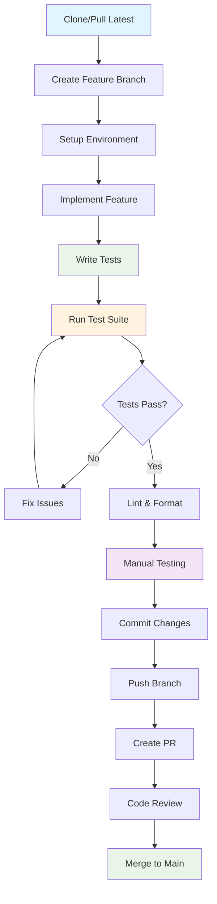

# 💻 Development Guide

**[← API](API.md)** | **[Home: README →](../README.md)**

Comprehensive development workflow and best practices for the Medical Data Search UI project.

## 📋 Table of Contents

- [Development Environment](#development-environment)
- [Getting Started](#getting-started)
- [Development Workflow](#development-workflow)
- [Code Quality Standards](#code-quality-standards)
- [Testing Practices](#testing-practices)
- [Git Workflow](#git-workflow)
- [Deployment](#deployment)
- [Troubleshooting](#troubleshooting)
- [Contributing Guidelines](#contributing-guidelines)

---

## Development Environment

### 🐳 DevContainer Setup (Recommended)

The project includes a complete DevContainer configuration for consistent development environments.

#### **Prerequisites**

- [Docker Desktop](https://www.docker.com/products/docker-desktop)
- [VS Code](https://code.visualstudio.com/)
- [Dev Containers Extension](https://marketplace.visualstudio.com/items?itemName=ms-vscode-remote.remote-containers)

#### **Quick Setup**

```bash
# 1. Clone repository
git clone <repository-url>
cd medical-search-ui

# 2. Open in VS Code
code .

# 3. Open Command Palette (Ctrl+Shift+P)
# 4. Select "Dev Containers: Reopen in Container"
# 5. Wait for container build and setup
```

#### **DevContainer Features**

```json
// .devcontainer/devcontainer.json
{
  "name": "Medical Search UI Dev Environment",
  "image": "mcr.microsoft.com/devcontainers/typescript-node:1-20-bullseye",
  "features": {
    "ghcr.io/devcontainers/features/docker-in-docker:2": {},
    "ghcr.io/devcontainers/features/github-cli:1": {}
  },
  "postCreateCommand": "npm install",
  "forwardPorts": [3000, 51204],
  "customizations": {
    "vscode": {
      "extensions": [
        "bradlc.vscode-tailwindcss",
        "esbenp.prettier-vscode",
        "ms-vscode.vscode-typescript-next",
        "vitest.explorer"
      ]
    }
  }
}
```

### 💻 Local Development Setup

If not using DevContainer, set up the environment locally:

#### **Prerequisites**

- Node.js 18+ (recommend using [nvm](https://github.com/nvm-sh/nvm))
- npm 8+
- Git

#### **Setup Steps**

```bash
# 1. Install Node.js (using nvm)
nvm install 18
nvm use 18

# 2. Clone and setup
git clone <repository-url>
cd medical-search-ui
npm install

# 3. Environment configuration
cp .env.example .env
# Edit .env with your settings

# 4. Start development
npm run dev
```

### 🔧 Development Tools

#### **VS Code Extensions**

```json
{
  "recommendations": [
    "bradlc.vscode-tailwindcss", // CSS utilities
    "esbenp.prettier-vscode", // Code formatting
    "ms-vscode.vscode-typescript-next", // TypeScript support
    "vitest.explorer", // Test runner
    "ms-vscode.vscode-json", // JSON support
    "christian-kohler.path-intellisense", // Path completion
    "formulahendry.auto-rename-tag" // HTML tag sync
  ]
}
```

#### **Browser Extensions**

- [React Developer Tools](https://chrome.google.com/webstore/detail/react-developer-tools/fmkadmapgofadopljbjfkapdkoienihi)
- [Accessibility Insights](https://accessibilityinsights.io/)

---

## Getting Started

### 🚀 First Steps

```bash
# 1. Start development server
npm run dev
# Starts Vite dev server on http://localhost:3000

# 2. Run tests
npm test
# Runs 247+ comprehensive unit tests

# 3. Open test UI (optional)
npm run test:ui
# Opens Vitest UI dashboard

# 4. Lint code
npm run lint
# Checks TypeScript and ESLint rules

# 5. Build for production
npm run build
# Creates optimized production build
```

### 📁 Project Structure Understanding

```
medical-search-ui/
├── 📁 .devcontainer/           # DevContainer configuration
│   └── devcontainer.json       # Dev environment setup
├── 📁 docs/                    # Comprehensive documentation
│   ├── Architecture.md         # Code structure and patterns
│   ├── Testing.md              # Testing strategy
│   ├── Components.md           # Component documentation
│   ├── API.md                  # FHIR integration
│   └── Development.md          # This file
├── 📁 src/
│   ├── 📁 components/          # React components
│   │   ├── SearchInput.tsx     # Search interface
│   │   ├── ConceptDetails.tsx  # Detail display
│   │   └── *.css               # Component styles
│   ├── 📁 hooks/               # Custom React hooks
│   │   └── useDebounce.ts      # Debouncing logic
│   ├── 📁 services/            # API service layer
│   │   └── fhirApi.ts          # FHIR integration
│   ├── 📁 test/                # Component tests
│   │   ├── *.test.tsx          # Test files
│   │   └── setup.ts            # Test configuration
│   ├── 📁 test-files/          # Sample FHIR data
│   ├── 📁 types/               # TypeScript definitions
│   └── 📁 utils/               # Utility functions
├── 📁 test-files/              # Additional test resources
├── package.json                # Dependencies and scripts
├── tsconfig.json               # TypeScript configuration
├── vitest.config.ts            # Test configuration
└── vite.config.ts              # Build configuration
```

### 🎯 Development Modes

#### **Online Mode (Default)**

```bash
VITE_OFFLINE_MODE=false npm run dev
```

- Connects to live FHIR endpoints
- Real SNOMED CT data
- Network error testing

#### **Offline Mode (Development)**

```bash
VITE_OFFLINE_MODE=true npm run dev
```

- Uses local sample data
- Consistent testing environment
- No network dependencies

---

## Development Workflow

### 🔄 Standard Development Cycle



### 📝 Feature Development Process

#### **1. Planning Phase**

```bash
# Check current state
git status
git pull origin main

# Create feature branch
git checkout -b feature/search-improvements
```

#### **2. Implementation Phase**

```bash
# Start development server
npm run dev

# Run tests in watch mode
npm run test:watch

# Implementation steps:
# - Write failing test
# - Implement feature
# - Make test pass
# - Refactor if needed
```

#### **3. Testing Phase**

```bash
# Run full test suite
npm test

# Check test coverage
npm run test:coverage

# Test offline mode
VITE_OFFLINE_MODE=true npm run dev

# Test production build
npm run build
npm run preview
```

#### **4. Quality Assurance**

```bash
# Lint code
npm run lint

# Format code
npm run format

# Type checking
npm run type-check

# Accessibility testing
# (Manual testing with screen reader)
```

### 🧪 Test-Driven Development (TDD)

#### **TDD Cycle**

```typescript
// 1. Write failing test
describe('New Feature', () => {
  it('should perform expected behavior', () => {
    // Arrange
    const component = render(<Component />);

    // Act
    const result = component.getByRole('button');

    // Assert
    expect(result).toBeInTheDocument();
  });
});

// 2. Run test (should fail)
npm test

// 3. Implement minimum code to pass
export function Component() {
  return <button>Click me</button>;
}

// 4. Run test (should pass)
npm test

// 5. Refactor and improve
export function Component({ onClick, children }: ComponentProps) {
  return (
    <button onClick={onClick} className="btn">
      {children}
    </button>
  );
}
```

---

## Code Quality Standards

### 📏 Coding Standards

#### **TypeScript Configuration**

```json
// tsconfig.json - Strict typing
{
  "compilerOptions": {
    "strict": true,
    "noImplicitAny": true,
    "strictNullChecks": true,
    "noImplicitReturns": true,
    "noFallthroughCasesInSwitch": true,
    "noUncheckedIndexedAccess": true
  }
}
```

#### **ESLint Rules**

```json
// .eslintrc.json
{
  "extends": [
    "@typescript-eslint/recommended",
    "plugin:react-hooks/recommended"
  ],
  "rules": {
    "@typescript-eslint/no-unused-vars": "error",
    "@typescript-eslint/explicit-function-return-type": "warn",
    "react-hooks/rules-of-hooks": "error",
    "react-hooks/exhaustive-deps": "warn"
  }
}
```

#### **Component Standards**

```typescript
// ✅ Good component structure
interface ComponentProps {
  // Data props
  data?: DataType;

  // State props
  isLoading?: boolean;
  error?: string | null;

  // Callback props
  onAction?: (param: Type) => void;

  // Configuration props
  placeholder?: string;
  className?: string;
}

export function Component({
  data,
  isLoading = false,
  error = null,
  onAction,
  placeholder = "Default text",
  className = "",
}: ComponentProps): JSX.Element {
  // Implementation
  return (
    <div className={`component ${className}`}>{/* Component content */}</div>
  );
}
```

#### **Function Standards**

```typescript
// ✅ Good function structure
/**
 * Searches SNOMED CT concepts using FHIR ValueSet $expand
 * @param filter - Search term to filter concepts
 * @returns Promise resolving to ValueSet expansion
 * @throws Error when API call fails or returns OperationOutcome
 */
export async function searchConcepts(
  filter: string
): Promise<ValueSetExpansion> {
  // Validation
  if (!filter.trim()) {
    throw new Error("Search filter cannot be empty");
  }

  // Implementation
  try {
    const result = await apiCall(filter);
    return parseResult(result);
  } catch (error) {
    console.error("Search failed:", error);
    throw error;
  }
}
```

### 🏗️ Architecture Principles

#### **DRY (Don't Repeat Yourself)**

```typescript
// ❌ Bad - Repeated logic
function SearchButton() {
  const handleClick = () => {
    setLoading(true);
    setError(null);
    // search logic
  };
}

function FilterButton() {
  const handleClick = () => {
    setLoading(true);
    setError(null);
    // filter logic
  };
}

// ✅ Good - Extracted common logic
function useAsyncAction() {
  const [loading, setLoading] = useState(false);
  const [error, setError] = useState<string | null>(null);

  const execute = useCallback(async (action: () => Promise<void>) => {
    setLoading(true);
    setError(null);
    try {
      await action();
    } catch (err) {
      setError(err instanceof Error ? err.message : "Unknown error");
    } finally {
      setLoading(false);
    }
  }, []);

  return { loading, error, execute };
}
```

#### **Single Responsibility Principle**

```typescript
// ✅ Good - Each function has one responsibility
function validateSearchTerm(term: string): boolean {
  return term.trim().length >= 2;
}

function encodeSearchTerm(term: string): string {
  return encodeURIComponent(term.trim());
}

function buildSearchUrl(baseUrl: string, term: string): string {
  const encodedTerm = encodeSearchTerm(term);
  return `${baseUrl}/ValueSet/$expand?filter=${encodedTerm}`;
}
```

### 🎨 Style Guidelines

#### **CSS Organization**

```css
/* Component-specific styles */
.search-input {
  /* Layout */
  display: flex;
  width: 100%;

  /* Visual */
  border: 2px solid var(--border-color);
  border-radius: 8px;
  background: var(--surface-color);

  /* Typography */
  font-size: 16px;
  line-height: 1.5;

  /* Interaction */
  transition: border-color 0.2s ease;
  cursor: text;
}

.search-input:focus {
  outline: none;
  border-color: var(--primary-color);
  box-shadow: 0 0 0 3px var(--primary-color-alpha);
}

/* Responsive design */
@media (max-width: 768px) {
  .search-input {
    font-size: 16px; /* Prevent zoom on iOS */
  }
}
```

#### **CSS Custom Properties**

```css
:root {
  /* Color system */
  --primary-color: #1976d2;
  --primary-color-alpha: rgba(25, 118, 210, 0.1);
  --surface-color: #ffffff;
  --border-color: #e0e0e0;

  /* Typography */
  --font-family: -apple-system, BlinkMacSystemFont, "Segoe UI", Roboto,
    sans-serif;
  --font-size-base: 1rem;
  --line-height-base: 1.5;

  /* Spacing */
  --spacing-xs: 0.25rem;
  --spacing-sm: 0.5rem;
  --spacing-md: 1rem;
  --spacing-lg: 1.5rem;
  --spacing-xl: 2rem;
}
```

---

## Testing Practices

### 🧪 Testing Strategy

Our testing approach ensures 80%+ code coverage with 247+ comprehensive tests.

#### **Test Categories**

1. **Unit Tests**: Individual functions and components
2. **Integration Tests**: Component interactions
3. **Accessibility Tests**: Screen reader and keyboard navigation
4. **Error Scenario Tests**: Network failures and edge cases
5. **Performance Tests**: Debouncing and cleanup

#### **Test Structure**

```typescript
// Standard test file structure
describe("Component/Function Name", () => {
  // Setup
  beforeEach(() => {
    vi.clearAllMocks();
  });

  describe("Feature Group", () => {
    it("should perform specific behavior", async () => {
      // Arrange - Setup test data and mocks
      const mockProps = { onAction: vi.fn() };

      // Act - Perform the action being tested
      render(<Component {...mockProps} />);
      await user.click(screen.getByRole("button"));

      // Assert - Verify expected outcomes
      expect(mockProps.onAction).toHaveBeenCalledWith(expectedValue);
    });
  });
});
```

#### **Mock Strategies**

```typescript
// API mocking
vi.mock("../services/fhirApi", () => ({
  searchConcepts: vi.fn(),
  lookupConcept: vi.fn(),
}));

// Hook mocking
vi.mock("../hooks/useDebounce", () => ({
  useDebounce: (value: any) => value, // Return immediately for tests
}));

// Timer mocking
vi.useFakeTimers();
act(() => {
  vi.advanceTimersByTime(500);
});
```

#### **Testing Commands**

```bash
# Run all tests
npm test

# Run tests with UI
npm run test:ui

# Run specific test file
npm test SearchInput.test.tsx

# Run tests in watch mode
npm test -- --watch

# Run tests with coverage
npm test -- --coverage

# Run tests matching pattern
npm test -- --testNamePattern="should handle user input"
```

### ✅ Test Quality Checklist

Before merging code, ensure:

- [ ] **Unit tests written** for new components/functions
- [ ] **Error scenarios tested** (network failures, invalid data)
- [ ] **Accessibility tested** (keyboard navigation, screen readers)
- [ ] **Edge cases covered** (empty data, long text, rapid interactions)
- [ ] **Mocks properly configured** (API calls, timers, external dependencies)
- [ ] **Test coverage >80%** for new code
- [ ] **Tests pass consistently** (no flaky tests)
- [ ] **Performance tests included** for complex interactions

---

## Git Workflow

### 🌿 Branching Strategy

```
main
├── feature/search-improvements    # Feature branches
├── feature/error-handling
├── hotfix/critical-bug-fix        # Hotfix branches
└── release/v1.2.0                 # Release branches
```

#### **Branch Naming Convention**

```bash
# Feature branches
feature/search-debouncing
feature/accessibility-improvements
feature/offline-mode-enhancements

# Bug fixes
bugfix/suggestion-list-rendering
bugfix/keyboard-navigation

# Hotfixes
hotfix/api-timeout-handling
hotfix/memory-leak-fix

# Documentation
docs/api-integration-guide
docs/component-documentation
```

### 📝 Commit Message Standards

Follow [Conventional Commits](https://www.conventionalcommits.org/):

```bash
# Format
<type>[optional scope]: <description>

[optional body]

[optional footer(s)]

# Examples
feat(search): add debounced search functionality

test(api): add comprehensive error handling tests

fix(accessibility): improve keyboard navigation in suggestions

docs(readme): update installation instructions

refactor(components): extract common hooks for reusability
```

#### **Commit Types**

- `feat`: New feature
- `fix`: Bug fix
- `test`: Adding or updating tests
- `docs`: Documentation changes
- `refactor`: Code refactoring
- `style`: Code formatting changes
- `perf`: Performance improvements
- `chore`: Build process or dependency updates

### 🔄 Pull Request Process

#### **PR Template**

```markdown
## Description

Brief description of changes and motivation.

## Type of Change

- [ ] Bug fix (non-breaking change which fixes an issue)
- [ ] New feature (non-breaking change which adds functionality)
- [ ] Breaking change (fix or feature that would cause existing functionality to not work as expected)
- [ ] Documentation update

## Testing

- [ ] All tests pass locally
- [ ] New tests added for new functionality
- [ ] Manual testing completed
- [ ] Accessibility testing performed

## Checklist

- [ ] Code follows project style guidelines
- [ ] Self-review completed
- [ ] Documentation updated
- [ ] No debug logging left in code
```

#### **Review Process**

1. **Automated Checks**: Tests, linting, type checking
2. **Code Review**: At least one approval required
3. **Manual Testing**: Verify functionality works as expected
4. **Documentation Review**: Ensure docs are updated
5. **Merge**: Squash and merge to main

---

## Deployment

### 🚀 Build Process

#### **Production Build**

```bash
# Build for production
npm run build

# Preview production build locally
npm run preview

# Build outputs to dist/ directory
dist/
├── index.html
├── assets/
│   ├── index-[hash].js    # Application bundle
│   ├── index-[hash].css   # Styles bundle
│   └── vendor-[hash].js   # Dependencies bundle
└── favicon.ico
```

#### **Build Configuration**

```typescript
// vite.config.ts
export default defineConfig({
  plugins: [react()],
  build: {
    outDir: "dist",
    sourcemap: true,
    rollupOptions: {
      output: {
        manualChunks: {
          vendor: ["react", "react-dom"],
          fhir: ["./src/services/fhirApi"],
        },
      },
    },
  },
});
```

### 🌐 Deployment Environments

#### **Development**

```bash
# Local development server
npm run dev

# Environment: development
# Hot module replacement enabled
# Source maps enabled
# Debug logging enabled
```

#### **Staging**

```bash
# Staging build
VITE_FHIR_BASE_URL=https://staging.fhir.server.com npm run build

# Environment: staging
# Production optimizations
# Staging FHIR endpoints
# Analytics disabled
```

#### **Production**

```bash
# Production build
VITE_FHIR_BASE_URL=https://r4.ontoserver.csiro.au/fhir npm run build

# Environment: production
# Minified and optimized
# Production FHIR endpoints
# Analytics enabled
```

### 📦 Docker Deployment

```dockerfile
# Dockerfile
FROM node:18-alpine AS builder

WORKDIR /app
COPY package*.json ./
RUN npm ci --only=production

COPY . .
RUN npm run build

FROM nginx:alpine
COPY --from=builder /app/dist /usr/share/nginx/html
COPY nginx.conf /etc/nginx/conf.d/default.conf

EXPOSE 80
CMD ["nginx", "-g", "daemon off;"]
```

---

## Troubleshooting

### 🐛 Common Issues

#### **Node Modules Issues**

```bash
# Clear node_modules and reinstall
rm -rf node_modules package-lock.json
npm install

# Clear npm cache
npm cache clean --force
```

#### **TypeScript Errors**

```bash
# Check TypeScript configuration
npx tsc --noEmit

# Restart TypeScript server in VS Code
# Ctrl+Shift+P -> "TypeScript: Restart TS Server"
```

#### **Test Failures**

```bash
# Clear test cache
npm test -- --clearCache

# Run tests with verbose output
npm test -- --verbose

# Run specific failing test
npm test -- --testNamePattern="specific test name"
```

#### **Vite Development Server Issues**

```bash
# Clear Vite cache
rm -rf node_modules/.vite

# Restart with clean cache
npm run dev -- --force
```

### 🔍 Debugging Techniques

#### **React DevTools**

```typescript
// Add debug information to components
function SearchInput(props: SearchInputProps) {
  // Debug props in development
  if (import.meta.env.DEV) {
    console.log("SearchInput props:", props);
  }

  return <input {...props} />;
}
```

#### **API Debugging**

```typescript
// Add detailed logging to API calls
export async function searchConcepts(
  filter: string
): Promise<ValueSetExpansion> {
  console.log("Search request:", {
    filter,
    timestamp: new Date().toISOString(),
  });

  try {
    const result = await fetch(url);
    console.log("Search response:", { status: result.status, url });
    return result;
  } catch (error) {
    console.error("Search error:", error);
    throw error;
  }
}
```

#### **Performance Debugging**

```typescript
// Use React Profiler
import { Profiler } from "react";

function onRenderCallback(id: string, phase: string, actualDuration: number) {
  console.log("Render:", { id, phase, actualDuration });
}

<Profiler id="App" onRender={onRenderCallback}>
  <App />
</Profiler>;
```

---

## Contributing Guidelines

### 🤝 How to Contribute

#### **1. Set Up Development Environment**

```bash
# Fork the repository on GitHub
# Clone your fork
git clone https://github.com/YOUR_USERNAME/medical-search-ui.git
cd medical-search-ui

# Add upstream remote
git remote add upstream https://github.com/ORIGINAL_OWNER/medical-search-ui.git

# Install dependencies
npm install
```

#### **2. Create Feature Branch**

```bash
# Create and switch to feature branch
git checkout -b feature/your-feature-name

# Keep branch up to date
git fetch upstream
git rebase upstream/main
```

#### **3. Development Process**

- Follow [code quality standards](#code-quality-standards)
- Write comprehensive tests (maintain >80% coverage)
- Update documentation for new features
- Test offline mode functionality
- Verify accessibility compliance

#### **4. Submit Pull Request**

- Push branch to your fork
- Create pull request with detailed description
- Ensure all checks pass
- Respond to review feedback
- Keep PR focused and atomic

### 📜 Code of Conduct

- **Be respectful** in all interactions
- **Focus on the code**, not the person
- **Help others learn** through constructive feedback
- **Follow project standards** and conventions
- **Test thoroughly** before submitting changes

### 🏆 Recognition

Contributors will be recognized in:

- Project README
- Release notes for significant contributions
- GitHub contributor graphs
- Code comments for complex implementations

---

## 🔗 Navigation

- **[⬅️ API Integration](API.md)** - FHIR endpoints and data handling
- **[🏗️ Architecture](Architecture.md)** - Code structure and design patterns
- **[🧪 Testing](Testing.md)** - Comprehensive testing strategy and coverage
- **[⚛️ Components](Components.md)** - Detailed component documentation
- **[🏠 README](../README.md)** - Project overview and quick start

---

_This development guide is part of the comprehensive Medical Data Search UI documentation suite. For questions or suggestions, please open an issue or submit a pull request._
