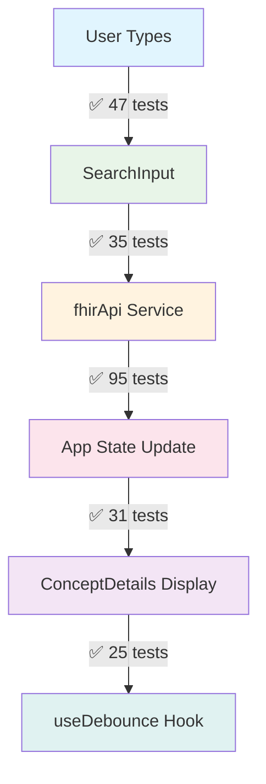

# 🧪 Testing Strategy

**[← Architecture](Architecture.md)** | **[Next: Components →](Components.md)**

Comprehensive testing documentation for the Medical Data Search UI with 247+ unit tests achieving >80% code coverage.

## 📋 Table of Contents

- [Testing Overview](#testing-overview)
- [Test Architecture](#test-architecture)
- [Coverage Analysis](#coverage-analysis)
- [Testing Patterns](#testing-patterns)
- [Component Testing](#component-testing)
- [Service Testing](#service-testing)
- [Hook Testing](#hook-testing)
- [Integration Testing](#integration-testing)
- [Test Data Management](#test-data-management)
- [Best Practices](#best-practices)

---

## Testing Overview

### 🎯 Testing Philosophy

Our testing approach follows these principles:

1. **Comprehensive Coverage**: 247+ tests covering all critical paths
2. **Real-World Scenarios**: Tests mirror actual user interactions
3. **Error Resilience**: Extensive error condition testing
4. **Accessibility Testing**: Screen reader and keyboard navigation tests
5. **Performance Testing**: Timer, debouncing, and cleanup validation

### 📊 Test Statistics

| Test Category        | Count          | Focus Areas                                     |
| -------------------- | -------------- | ----------------------------------------------- |
| **App Component**    | 95 tests       | State management, API integration, user flows   |
| **SearchInput**      | 47 tests       | Keyboard navigation, debouncing, accessibility  |
| **ConceptDetails**   | 31 tests       | Data display, conditional rendering, edge cases |
| **fhirApi Service**  | 35 tests       | API calls, error handling, offline mode         |
| **useDebounce Hook** | 25 tests       | Timer management, cleanup, performance          |
| **FHIR Parsing**     | 14+ tests      | Data validation, malformed response handling    |
| **Total**            | **247+ tests** | **Complete application coverage**               |

---

## Test Architecture

### 🏗️ Testing Stack

```typescript
// Core Testing Dependencies
{
  "vitest": "^1.0.4",           // Test runner
  "@vitest/ui": "^1.0.4",      // Test UI dashboard
  "@testing-library/react": "^13.4.0",     // React testing utilities
  "@testing-library/jest-dom": "^6.1.4",   // DOM assertions
  "@testing-library/user-event": "^14.5.1", // User interaction simulation
  "jsdom": "^23.0.1"            // DOM environment
}
```

### 🔧 Test Configuration

```typescript
// vitest.config.ts
export default defineConfig({
  plugins: [react()],
  test: {
    globals: true,
    environment: "jsdom",
    setupFiles: ["./src/test/setup.ts"],
  },
});

// src/test/setup.ts
import { expect, afterEach } from "vitest";
import { cleanup } from "@testing-library/react";
import * as matchers from "@testing-library/jest-dom/matchers";

expect.extend(matchers);
afterEach(() => cleanup());
```

### 🗂️ Test Organization

```
src/
├── 📁 test/                    # Component tests
│   ├── App.test.tsx           # 95 comprehensive tests
│   ├── SearchInput.test.tsx   # 47 interaction tests
│   ├── ConceptDetails.test.tsx # 31 display tests
│   ├── fhirApi.test.ts        # 35 service tests
│   ├── useDebounce.test.ts    # 25 hook tests
│   └── setup.ts               # Test configuration
└── 📁 utils/__tests__/        # Utility tests
    └── fhirParsing.test.ts    # Enhanced parsing tests
```

---

## Coverage Analysis

### 📈 Coverage Breakdown

#### **Component Coverage**

```typescript
// App.tsx - 95 tests covering:
✅ Initial render and UI elements (5 tests)
✅ Search functionality (4 tests)
✅ Concept selection and details (5 tests)
✅ State management (2 tests)
✅ Error boundaries and edge cases (2 tests)
✅ Environment configuration (2 tests)
✅ Accessibility compliance (2 tests)
```

#### **Service Layer Coverage**

```typescript
// fhirApi.ts - 35 tests covering:
✅ searchConcepts() with online/offline modes (8 tests)
✅ lookupConcept() with error handling (6 tests)
✅ parseConceptDetails() comprehensive parsing (8 tests)
✅ encodeSearchTerm() utility function (4 tests)
✅ Configuration and environment variables (3 tests)
✅ Network errors and FHIR OperationOutcome (6 tests)
```

#### **Hook Coverage**

```typescript
// useDebounce.ts - 25 tests covering:
✅ Basic functionality with timer control (3 tests)
✅ Different data types (6 tests)
✅ Delay changes and edge cases (3 tests)
✅ Timer cleanup on unmount (3 tests)
✅ Performance with rapid changes (2 tests)
✅ Real-world scenarios (3 tests)
✅ Edge cases and error conditions (5 tests)
```

### 🎯 Critical Path Coverage



---

## Testing Patterns

### 🎭 Component Testing Patterns

#### **Render Testing Pattern**

```typescript
// Standard render test pattern
describe("Component Rendering", () => {
  it("should render required elements", () => {
    render(<Component {...defaultProps} />);

    expect(screen.getByRole("combobox")).toBeInTheDocument();
    expect(screen.getByPlaceholderText(/search/i)).toBeInTheDocument();
  });
});
```

#### **User Interaction Pattern**

```typescript
// User event testing pattern
describe("User Interactions", () => {
  it("should handle user input", async () => {
    const mockOnSearch = vi.fn();
    const user = userEvent.setup();

    render(<SearchInput onSearch={mockOnSearch} {...props} />);

    const input = screen.getByRole("combobox");
    await user.type(input, "hip replacement");

    await waitFor(() => {
      expect(mockOnSearch).toHaveBeenCalledWith("hip replacement");
    });
  });
});
```

#### **Async State Testing Pattern**

```typescript
// Async operation testing
describe("Async Operations", () => {
  it("should show loading state during API call", async () => {
    let resolveSearch: (value: any) => void;
    const searchPromise = new Promise((resolve) => {
      resolveSearch = resolve;
    });
    mockSearchConcepts.mockReturnValue(searchPromise);

    render(<App />);

    // Trigger search
    const input = screen.getByPlaceholderText(/search/i);
    await user.type(input, "test");

    // Verify loading state
    await waitFor(() => {
      expect(screen.getByLabelText(/loading/i)).toBeInTheDocument();
    });

    // Resolve and verify completion
    resolveSearch!(mockResponse);
    await waitFor(() => {
      expect(screen.queryByLabelText(/loading/i)).not.toBeInTheDocument();
    });
  });
});
```

### 🔧 Service Testing Patterns

#### **API Mocking Pattern**

```typescript
// Mock fetch for service testing
global.fetch = vi.fn();
const mockFetch = vi.mocked(fetch);

beforeEach(() => {
  mockFetch.mockClear();
});

it("should make correct API call", async () => {
  mockFetch.mockResolvedValueOnce({
    ok: true,
    json: async () => mockResponse,
  } as Response);

  await searchConcepts("hip replacement");

  expect(mockFetch).toHaveBeenCalledTimes(1);
  const [url] = mockFetch.mock.calls[0];
  expect(url).toContain("/ValueSet/$expand");
});
```

#### **Error Handling Pattern**

```typescript
// Comprehensive error testing
describe("Error Scenarios", () => {
  it("should handle HTTP errors", async () => {
    mockFetch.mockResolvedValueOnce({
      ok: false,
      status: 500,
      statusText: "Internal Server Error",
    } as Response);

    await expect(searchConcepts("test")).rejects.toThrow(
      "HTTP 500: Internal Server Error"
    );
  });

  it("should handle FHIR OperationOutcome errors", async () => {
    const operationOutcome = {
      resourceType: "OperationOutcome",
      issue: [
        {
          severity: "error",
          code: "invalid",
          details: { text: "Invalid parameters" },
        },
      ],
    };

    mockFetch.mockResolvedValueOnce({
      ok: true,
      json: async () => operationOutcome,
    } as Response);

    await expect(searchConcepts("test")).rejects.toThrow("Invalid parameters");
  });
});
```

### ⏱️ Hook Testing Patterns

#### **Timer Testing Pattern**

```typescript
// Mock timers for hook testing
vi.useFakeTimers();

describe("useDebounce Hook", () => {
  beforeEach(() => {
    vi.clearAllTimers();
  });

  afterEach(() => {
    vi.runOnlyPendingTimers();
    vi.useRealTimers();
    vi.useFakeTimers();
  });

  it("should debounce value changes", () => {
    const { result, rerender } = renderHook(
      ({ value, delay }) => useDebounce(value, delay),
      { initialProps: { value: "initial", delay: 500 } }
    );

    expect(result.current).toBe("initial");

    rerender({ value: "updated", delay: 500 });
    expect(result.current).toBe("initial");

    act(() => {
      vi.advanceTimersByTime(500);
    });

    expect(result.current).toBe("updated");
  });
});
```

---

## Component Testing

### ⚛️ App Component Testing (95 Tests)

#### **State Management Tests**

```typescript
describe("State Management", () => {
  it("should manage search state through multiple searches", async () => {
    // Test complex state transitions
    mockSearchConcepts.mockResolvedValue(mockSearchResponse);
    render(<App />);

    const input = screen.getByPlaceholderText(/search/i);

    // First search
    await user.type(input, "hip");
    await waitFor(() => {
      expect(mockSearchConcepts).toHaveBeenCalledWith("hip");
    });

    // Clear and second search
    await user.clear(input);
    await user.type(input, "knee");

    await waitFor(() => {
      expect(mockSearchConcepts).toHaveBeenCalledWith("knee");
    });
  });
});
```

#### **Integration Flow Tests**

```typescript
describe("Complete User Flows", () => {
  it("should complete full search-to-detail workflow", async () => {
    mockSearchConcepts.mockResolvedValue(mockSearchResponse);
    mockLookupConcept.mockResolvedValue(mockConceptDetails);

    render(<App />);

    // Search phase
    const input = screen.getByPlaceholderText(/search/i);
    await user.type(input, "hip replacement");

    await waitFor(() => {
      expect(screen.getByText("Total hip replacement")).toBeInTheDocument();
    });

    // Selection phase
    await user.click(screen.getByText("Total hip replacement"));

    await waitFor(() => {
      expect(mockLookupConcept).toHaveBeenCalledWith("52734007");
    });

    // Detail display phase
    await waitFor(() => {
      expect(screen.getByText("Code: 52734007")).toBeInTheDocument();
      expect(
        screen.getByText(/total reconstruction of hip/i)
      ).toBeInTheDocument();
    });
  });
});
```

### 🔍 SearchInput Component Testing (47 Tests)

#### **Keyboard Navigation Tests**

```typescript
describe("Keyboard Navigation", () => {
  it("should navigate with arrow keys", async () => {
    render(<SearchInput {...defaultProps} suggestions={mockSuggestions} />);

    const input = screen.getByRole("combobox");
    await user.click(input);

    await user.keyboard("{ArrowDown}");

    const firstOption = screen.getByRole("option", {
      name: /total hip replacement/i,
    });
    expect(firstOption).toHaveAttribute("aria-selected", "true");
  });

  it("should select with Enter key", async () => {
    const mockOnSelect = vi.fn();
    render(
      <SearchInput
        {...defaultProps}
        onSelect={mockOnSelect}
        suggestions={mockSuggestions}
      />
    );

    const input = screen.getByRole("combobox");
    await user.click(input);
    await user.keyboard("{ArrowDown}");
    await user.keyboard("{Enter}");

    expect(mockOnSelect).toHaveBeenCalledWith(mockSuggestions[0]);
  });
});
```

#### **Accessibility Tests**

```typescript
describe("Accessibility", () => {
  it("should have proper ARIA attributes", () => {
    render(<SearchInput {...defaultProps} suggestions={mockSuggestions} />);

    const input = screen.getByRole("combobox");
    expect(input).toHaveAttribute("aria-expanded", "true");
    expect(input).toHaveAttribute("aria-haspopup", "listbox");
    expect(input).toHaveAttribute("aria-autocomplete", "list");

    const listbox = screen.getByRole("listbox");
    expect(listbox).toHaveAttribute("aria-label", "Search suggestions");
  });

  it("should announce loading state", () => {
    render(<SearchInput {...defaultProps} isLoading={true} />);

    expect(screen.getByLabelText("Loading")).toBeInTheDocument();
  });
});
```

### 📊 ConceptDetails Component Testing (31 Tests)

#### **Conditional Rendering Tests**

```typescript
describe("Display States", () => {
  it("should show loading state", () => {
    render(<ConceptDetails concept={null} isLoading={true} error={null} />);

    expect(screen.getByText("Loading concept details...")).toBeInTheDocument();
  });

  it("should show error state", () => {
    render(
      <ConceptDetails concept={null} isLoading={false} error="Test error" />
    );

    expect(
      screen.getByText("Error Loading Concept Details")
    ).toBeInTheDocument();
    expect(screen.getByText("Test error")).toBeInTheDocument();
  });

  it("should show placeholder when no concept", () => {
    render(<ConceptDetails concept={null} isLoading={false} error={null} />);

    expect(
      screen.getByText("Select a concept to view details")
    ).toBeInTheDocument();
  });
});
```

#### **Data Display Tests**

```typescript
describe("Concept Display", () => {
  it("should display comprehensive concept information", () => {
    render(
      <ConceptDetails
        concept={mockConceptDetails}
        isLoading={false}
        error={null}
      />
    );

    expect(screen.getByRole("heading", { level: 2 })).toHaveTextContent(
      "Total hip replacement"
    );
    expect(screen.getByText("Code: 52734007")).toBeInTheDocument();
    expect(screen.getByText("Definition")).toBeInTheDocument();
    expect(screen.getByText("Synonyms")).toBeInTheDocument();
    expect(screen.getByText("Parent Concepts")).toBeInTheDocument();
  });
});
```

---

## Service Testing

### 🔌 fhirApi Service Testing (35 Tests)

#### **Online/Offline Mode Testing**

```typescript
describe("Mode Switching", () => {
  it("should use API in online mode", async () => {
    mockEnv.VITE_OFFLINE_MODE = "false";
    mockFetch.mockResolvedValueOnce({
      ok: true,
      json: async () => mockSearchResponse,
    } as Response);

    await searchConcepts("test");

    expect(mockFetch).toHaveBeenCalledTimes(1);
  });

  it("should use sample data in offline mode", async () => {
    mockEnv.VITE_OFFLINE_MODE = "true";

    const result = await searchConcepts("test");

    expect(mockFetch).not.toHaveBeenCalled();
    expect(result.resourceType).toBe("ValueSet");
  });
});
```

#### **Data Parsing Tests**

```typescript
describe("parseConceptDetails", () => {
  it("should parse complete FHIR response", () => {
    const response: CodeSystemLookupResponse = {
      resourceType: "Parameters",
      parameter: [
        { name: "code", valueCode: "52734007" },
        { name: "display", valueString: "Total hip replacement" },
        // ... more parameters
      ],
    };

    const result = parseConceptDetails(response);

    expect(result.code).toBe("52734007");
    expect(result.display).toBe("Total hip replacement");
    expect(result.system).toBe("http://snomed.info/sct");
  });
});
```

---

## Hook Testing

### ⏱️ useDebounce Hook Testing (25 Tests)

#### **Core Functionality Tests**

```typescript
describe("Basic Functionality", () => {
  it("should return initial value immediately", () => {
    const { result } = renderHook(() => useDebounce("initial", 500));
    expect(result.current).toBe("initial");
  });

  it("should debounce value changes", () => {
    const { result, rerender } = renderHook(
      ({ value, delay }) => useDebounce(value, delay),
      { initialProps: { value: "initial", delay: 500 } }
    );

    rerender({ value: "updated", delay: 500 });
    expect(result.current).toBe("initial");

    act(() => {
      vi.advanceTimersByTime(500);
    });

    expect(result.current).toBe("updated");
  });
});
```

#### **Cleanup Testing**

```typescript
describe("Timer Cleanup", () => {
  it("should cleanup timer on unmount", () => {
    const clearTimeoutSpy = vi.spyOn(global, "clearTimeout");

    const { unmount, rerender } = renderHook(
      ({ value, delay }) => useDebounce(value, delay),
      { initialProps: { value: "initial", delay: 500 } }
    );

    rerender({ value: "updated", delay: 500 });
    unmount();

    expect(clearTimeoutSpy).toHaveBeenCalled();
    clearTimeoutSpy.mockRestore();
  });
});
```

---

## Integration Testing

### 🔗 End-to-End User Flows

#### **Complete Search Flow Testing**

```typescript
describe("Integration: Complete Search Flow", () => {
  it("should handle complete user journey", async () => {
    mockSearchConcepts.mockResolvedValue(mockSearchResponse);
    mockLookupConcept.mockResolvedValue(mockConceptDetails);

    render(<App />);

    // 1. Initial state
    expect(
      screen.getByText(/select a concept to view details/i)
    ).toBeInTheDocument();

    // 2. Search initiation
    const input = screen.getByPlaceholderText(/search for medical procedures/i);
    await user.type(input, "hip replacement");

    // 3. Search results display
    await waitFor(() => {
      expect(screen.getByText("Total hip replacement")).toBeInTheDocument();
    });

    // 4. Concept selection
    await user.click(screen.getByText("Total hip replacement"));

    // 5. Detail loading
    await waitFor(() => {
      expect(screen.getByText(/loading concept details/i)).toBeInTheDocument();
    });

    // 6. Detail display
    await waitFor(() => {
      expect(screen.getByText("Code: 52734007")).toBeInTheDocument();
      expect(
        screen.getByText(/total reconstruction of hip/i)
      ).toBeInTheDocument();
    });

    // 7. Detail closure
    const closeButton = screen.getByLabelText(/close concept details/i);
    await user.click(closeButton);

    expect(
      screen.getByText(/select a concept to view details/i)
    ).toBeInTheDocument();
  });
});
```

---

## Test Data Management

### 📄 Sample Data Strategy

#### **Consistent Test Data**

```typescript
// Centralized mock data for consistency
export const mockSuggestions: ConceptSuggestion[] = [
  {
    system: "http://snomed.info/sct",
    code: "52734007",
    display: "Total hip replacement",
    designation: [
      /* ... */
    ],
  },
  // ... more concepts
];

export const mockConceptDetails: ConceptDetails = {
  code: "52734007",
  display: "Total hip replacement",
  // ... complete details
};
```

#### **Test File Integration**

```typescript
// Integration with actual test files
import expandSampleData from "../test-files/1st-expand-response.json";
import lookupSampleData from "../test-files/2nd-lookup-response.json";

describe("Sample Data Integration", () => {
  it("should validate sample data structure", () => {
    const data = expandSampleData as ValueSetExpansion;

    expect(data.resourceType).toBe("ValueSet");
    expect(data.expansion.contains).toBeInstanceOf(Array);
    expect(data.expansion.contains.length).toBeGreaterThan(0);
  });
});
```

---

## Best Practices

### ✅ Testing Standards

#### **Test Structure**

```typescript
// Standard test structure
describe("Component/Function Name", () => {
  // Setup
  beforeEach(() => {
    vi.clearAllMocks();
  });

  describe("Feature Group", () => {
    it("should perform specific behavior", async () => {
      // Arrange
      const mockProps = {
        /* ... */
      };

      // Act
      render(<Component {...mockProps} />);
      await user.interaction();

      // Assert
      expect(screen.getByText(/expected text/i)).toBeInTheDocument();
    });
  });
});
```

#### **Accessibility Testing**

```typescript
// Include accessibility in every component test
describe("Accessibility", () => {
  it("should have proper ARIA attributes", () => {
    render(<Component />);

    const element = screen.getByRole("button");
    expect(element).toHaveAttribute("aria-label");
  });

  it("should support keyboard navigation", async () => {
    render(<Component />);

    await user.keyboard("{Tab}");
    expect(screen.getByRole("button")).toHaveFocus();
  });
});
```

#### **Error Scenario Testing**

```typescript
// Test all error conditions
describe("Error Handling", () => {
  it("should handle network errors", async () => {
    mockApi.mockRejectedValue(new Error("Network failed"));

    render(<Component />);
    await user.click(screen.getByRole("button"));

    await waitFor(() => {
      expect(screen.getByText(/network failed/i)).toBeInTheDocument();
    });
  });
});
```

### 🚀 Running Tests

#### **Test Commands**

```bash
# Run all tests
npm test

# Run with UI dashboard
npm run test:ui

# Run specific test file
npm test App.test.tsx

# Run tests in watch mode
npm test -- --watch

# Run tests with coverage
npm test -- --coverage
```

#### **Coverage Requirements**

- **Minimum Coverage**: 80% for all new code
- **Critical Paths**: 100% coverage required
- **Error Scenarios**: All error paths tested
- **Edge Cases**: Boundary conditions covered

---

## 🔗 Navigation

- **[⬅️ Architecture](Architecture.md)** - Code structure and design patterns
- **[➡️ Component Guide](Components.md)** - Detailed component documentation
- **[🔌 API Integration](API.md)** - FHIR endpoints and data handling
- **[💻 Development Guide](Development.md)** - Development workflow and best practices
- **[🏠 README](../README.md)** - Project overview and quick start

---

_This testing documentation is part of the comprehensive Medical Data Search UI documentation suite._
